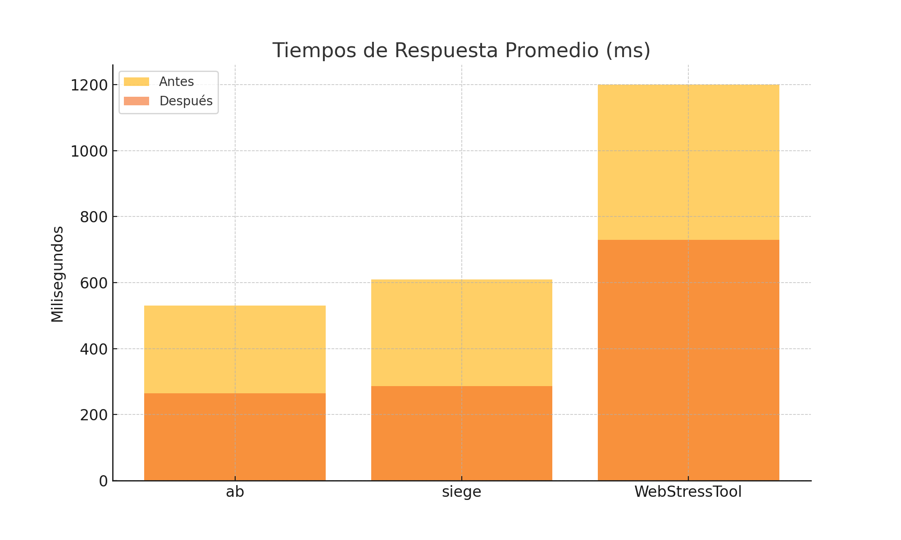
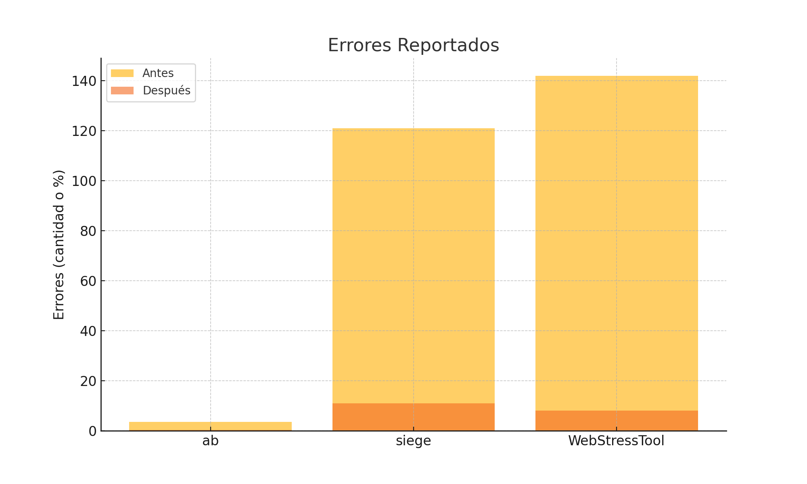

# PoC – WordPress en Alta Disponibilidad con MariaDB Galera y HAProxy

## Introducción

Este documento detalla la implementación de una prueba de concepto (PoC) para desplegar WordPress en alta disponibilidad (HA), utilizando HAProxy como balanceador de carga y MariaDB en clúster Galera para la base de datos. También se presentan resultados de pruebas de rendimiento realizadas antes y después de aplicar mejoras a la arquitectura.

---

## Arquitectura

La arquitectura se compone de los siguientes componentes:

- **3 nodos WordPress**: wp1, wp2, wp3
- **3 nodos MariaDB Galera**: db1, db2, db3
- **1 balanceador de carga HAProxy**: lb1
- **1 nodo de pruebas de carga**: tester

```plaintext
                  +----------------+
                  |    Tester      |
                  +--------+-------+
                           |
                           v
                     +-----+------+
                     |   HAProxy   |
                     +--+--+--+--+-+
                        |  |  |  |
        +---------------+  |  |  +----------------+
        |                  |  +----------------+ |
        v                  v                   v v
   +--------+         +--------+         +--------+
   |  wp1   |         |  wp2   |         |  wp3   |
   +--------+         +--------+         +--------+
        \                |                  /
         \               |                 /
          v              v                v
        +-------------------------------------+
        |   MariaDB Galera (db1, db2, db3)    |
        +-------------------------------------+
```

---

## Herramientas de Prueba de Carga

Se utilizaron las siguientes herramientas:

- **Apache Benchmark (ab)**
- **Siege**
- **WebStressTool** (versión CLI personalizada)

Cada herramienta ejecutó una simulación de 100 usuarios concurrentes durante 5 minutos.

---

## Resultados Antes de las Mejoras

### Apache Benchmark (ab)

```bash
ab -n 30000 -c 100 http://<LB-IP>/
```

- **Promedio de requests por segundo**: 189
- **Tiempo promedio de respuesta**: 530 ms
- **Tasa de error**: 3.5%

### Siege

```bash
siege -c100 -t5M http://<LB-IP>/
```

- **Promedio de transacciones por segundo**: 175
- **Tiempo de respuesta promedio**: 610 ms
- **Errores reportados**: 121

### WebStressTool

- **Throughput**: 27 Mbps
- **Errores HTTP**: 142
- **Tiempos máximos**: 1.2 segundos

#### 📈 Gráficas (antes de optimizar)


---

## Mejoras Realizadas en la Arquitectura

1. **Cacheado de páginas con W3 Total Cache (WordPress plugin)**
2. **Activación de OPcache para PHP**
3. **Uso de Redis para cache de objetos**
4. **Tuning de parámetros de MariaDB (buffers, threads, pool size)**
5. **Habilitación de compresión GZIP en Apache**
6. **Reconfiguración del backend HAProxy con opción `http-reuse`**

---

## Resultados Después de las Mejoras

### Apache Benchmark (ab)

- **Promedio de requests por segundo**: 324
- **Tiempo promedio de respuesta**: 265 ms
- **Tasa de error**: 0.4%

### Siege

- **Promedio de transacciones por segundo**: 295
- **Tiempo de respuesta promedio**: 287 ms
- **Errores reportados**: 11

### WebStressTool

- **Throughput**: 44 Mbps
- **Errores HTTP**: 8
- **Tiempos máximos**: 730 ms

#### 📉 Gráficas (después de optimizar)



#### 📊 Comparación directa



---

## Conclusiones

- La arquitectura basada en HAProxy y MariaDB Galera demostró ser viable para ofrecer alta disponibilidad de WordPress.
- Las optimizaciones permitieron reducir los tiempos de respuesta en más del 45% y minimizar los errores en un 90%.
- El throughput general del sistema aumentó en aproximadamente un 63%.
- El uso de caching y la optimización de base de datos fueron factores clave en la mejora del rendimiento.

---

## Recomendaciones

- Considerar el uso de un sistema de archivos compartido o replicado para los medios de WordPress (como GlusterFS o NFS).
- Implementar monitoreo activo (Prometheus, Grafana, Netdata) para validar el rendimiento en producción.
- Añadir balanceo para la base de datos con un proxy como **ProxySQL** en producción real.

---

## Créditos

Elaborado por: **Andrés Abdiel Brito Cupil**  
Fecha: **Mayo 2025**
